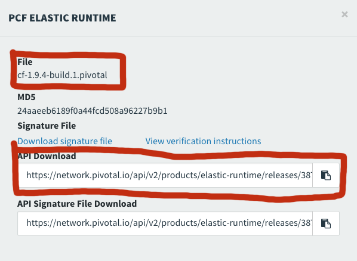

# pcf-helper-scripts

These scripts help you to download tiles from PivNet and import them into Ops Manager. They are intended to be run on your Ops Manager server. 

Note that this script assumes you have already accepted the EULA for the versions of the products you are downloading. Start the download in a browser, accept the EULA and then cancel the download. 

Remember to chmod +x *.sh on these scripts to make them executable. 

## downloadtile.sh

This script downloads products from PivNet. Your PivNet token is found on network.pivotal.io in your profile. It is the API TOKEN located at the bottom of the Edit Profile page.


The first parameter is your PivNet token
The second paramter is the name of the downloaded file. I usually use the Filename posted for the release (see image below)
The third parameter is the download URL which is found on the information section for the product and version you are downloading.
+
An example of running this script:

```
$ ../scripts/downloadtile.sh PIVNET_TOKEN cf-1.9.4-build.1.pivotal https://network.pivotal.io/api/v2/products/elastic-runtime/releases/3875/product_files/12073/download
```


## importtile.sh

This script uploads downloaded tiles into Ops Manager. To use this script you need your Ops Manager username and password.

The first parameter is the local filename of the Pivotal product
The second parameter is your Ops Manager user name
The third parameter is your Ops Manager password

An example of running this script:

```
$ ../scripts/importtile.sh product-filename "OPSMGR-UserName" "OPSMGR-Pwd"
```
